# Portfolio

Une sélection qui inclut des projets "publics" sur GitLab et sur Bitbucket. Le nombre total de projets est plus vaste que cette sélection. Beaucoup de projets demeurent "privés" sur d'autres comptes GitHub, sur GitLab et sur Bitbucket. 

## Programmation et Bases de données

| Projet | Aperçu | Lien |
|:-----|:-----|:-----|
| Programmation Python |  | bouton droit vers: <a href="https://github.com/ugolabo/programmation_python" target="_blank">repo</a>  |  |
| Formation |   | bouton droit vers: <a href="https://ugolab.gitlab.io/formation/description/" target="_blank">site</a>  |
| Environnements virtuels, empaquetage, conteneurs Dockers |   | bouton droit vers: <a href="https://github.com/ugolabo/env_empaquetage_docker" target="_blank">repo</a>  |
| CI/CD: fichier Python, linting et tests unitaires |   | bouton droit vers: <a href="https://github.com/ugolabo/cicd_python_linting_tests" target="_blank">repo</a>  |
| Bases de données SQL et NoSQL |   | bouton droit vers: <a href="https://github.com/ugolabo/bases_donnees_sql_nosql" target="_blank">repo</a>  |

## Data Science, Machine Learning

| Projet | Aperçu | Lien |
|:-----|:-----|:-----|
| Portfolio de Data Science   *Porfolio développé avant 2020 et dont quelques projets mériteraient une mise à jour. Projets en Python et langage R.*  |   | bouton droit vers: <a href="https://ugofolio.netlify.app/portfolio/" target="_blank">site</a> (Bitbucket -> Netlify)  |
| Machine Learning avec Random Forests  |   | bouton droit vers: <a href="https://github.com/ugolabo/ml_random_forests" target="_blank">repo</a> |
| Machine Learning avec Random Forests sur Streamlit   *Machine Learning avec Random Forests sur Streamlit explique le projet, mais n'alimente plus Streamlit Cloud pour l'app interactive. Machine Learning avec Random Forests sur Streamlit (v2) alimente uniquement Streamlit Cloud.* |   | bouton droit vers: <a href="https://github.com/ugolabo/ml_random_forests_streamlit" target="_blank">repo</a>  |
| Machine Learning avec Random Forests sur Streamlit (v2)  |   | bouton droit vers: <a href="https://github.com/ugolabo/ml_random_forests_streamlit_v2" target="_blank">repo</a> (avec lien vers le site Streamlit)  |
| Démo Quarto, article, format HTML (chars)  | 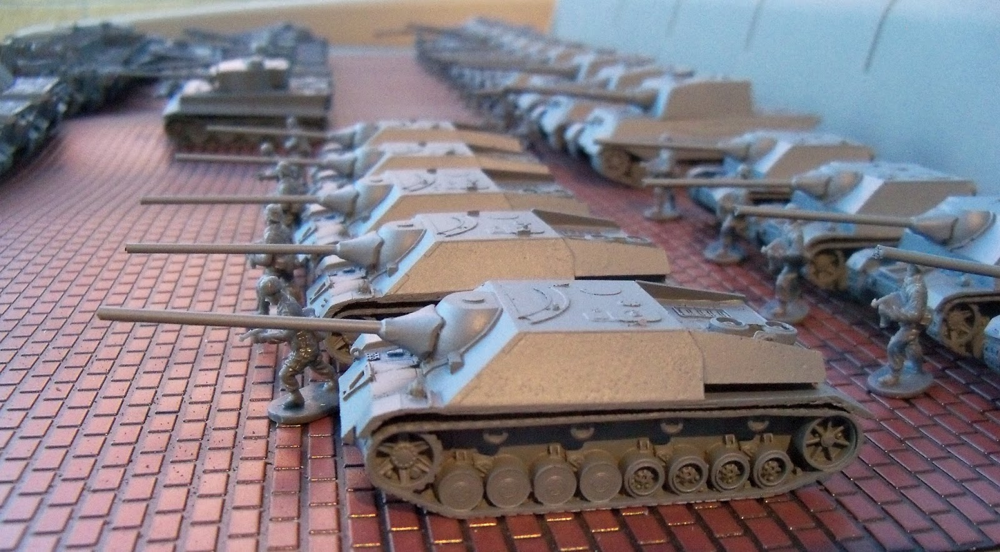  | bouton droit vers: <a href="https://github.com/ugolabo/demo_quarto_article_html_chars" target="_blank">repo</a> ; bouton droit vers: <a href="https://ugolabo.github.io/demo_quarto_article_html_chars/" target="_blank">site</a>  |
| Démo Quarto, article, formats HTML et PDF (graphiques)  |   | bouton droit vers: <a href="https://github.com/ugolabo/demo_quarto_article_html_pdf_graphiques" target="_blank">repo</a> ; bouton droit vers: <a href="https://ugolabo.github.io/demo_quarto_article_html_pdf_graphiques/" target="_blank">site</a> |
| Demo, report Quarto, tufte HTML (churn)   *Même projet avec le sujet du Customer churn analysis. En divers formats de diffusion: rapport HTML (consultation sur support numérique) vs livre (impression, publication) ; dashboard (compact et superficiel) vs site web (complet et sophistiqué).*  | 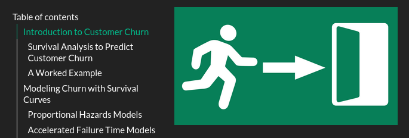  | bouton droit vers: <a href="https://github.com/ugolabo/demo_quarto_report_tufte_html_churn" target="_blank">repo</a> ; bouton droit vers: <a href="https://ugolabo.github.io/demo_quarto_report_tufte_html_churn/" target="_blank">site</a> |
| Demo, book Quarto, PDF (churn)[^c]  | 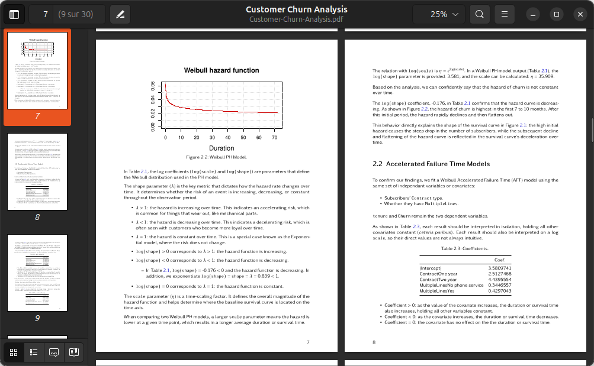  | bouton droit vers: <a href="https://github.com/ugolabo/demo_book_quarto_pdf_churn" target="_blank">repo</a> ; bouton droit vers: <a href="https://https://ugolabo.github.io/demo_book_quarto_pdf_churn/" target="_blank">site</a> |
| Demo, dashboard Quarto, HTML (churn)[^c]  | 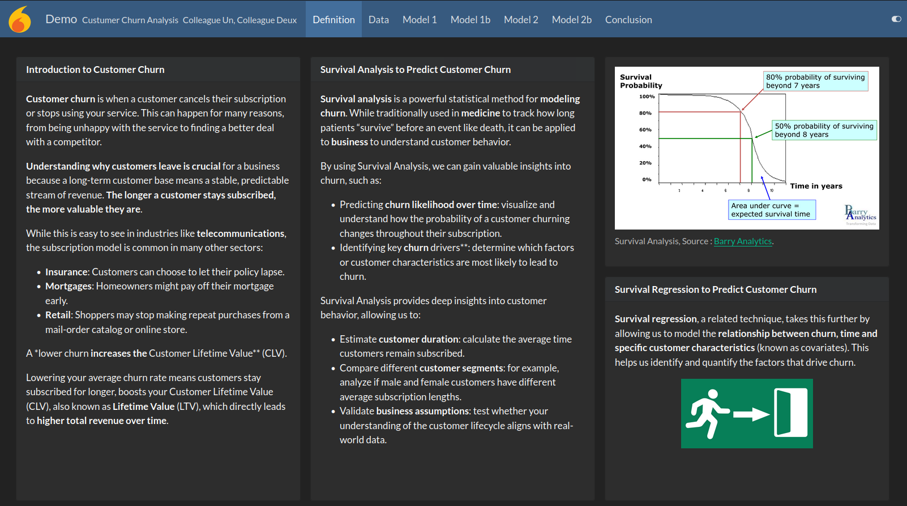  | bouton droit vers: <a href="https://github.com/ugolabo/demo_quarto_dashboard_html_churn" target="_blank">repo</a> ; bouton droit vers: <a href="https://https://ugolabo.github.io/demo_quarto_dashboard_html_churn/" target="_blank">site</a> |
| Demo, website Quarto, HTML (churn)[^c]  | 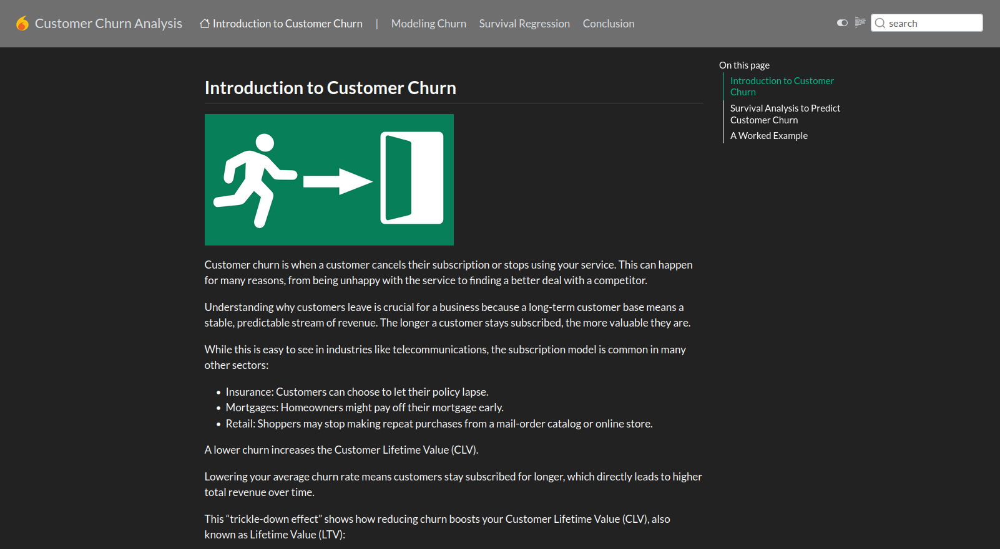  | bouton droit vers: <a href="https://github.com/ugolabo/demo_website_quarto_html_churn" target="_blank">repo</a> ; bouton droit vers: <a href="https://https://ugolabo.github.io/demo_website_quarto_html_churn/" target="_blank">site</a> |

## Web et Sites Documentaires

| Projet | Aperçu | Lien |
|:-----|:-----|:-----|
| Page web interactive; grille à colorier  | 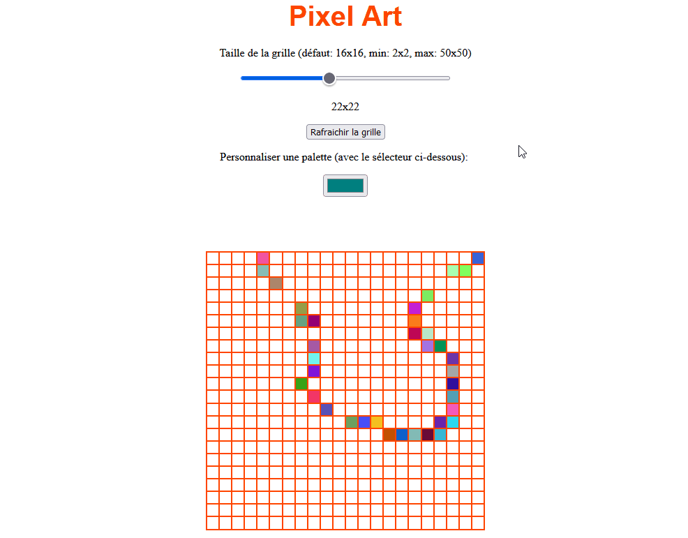  | bouton droit vers: <a href="https://github.com/ugolabo/page_web_interactive" target="_blank">repo</a>  |
| Boite de recherche  | 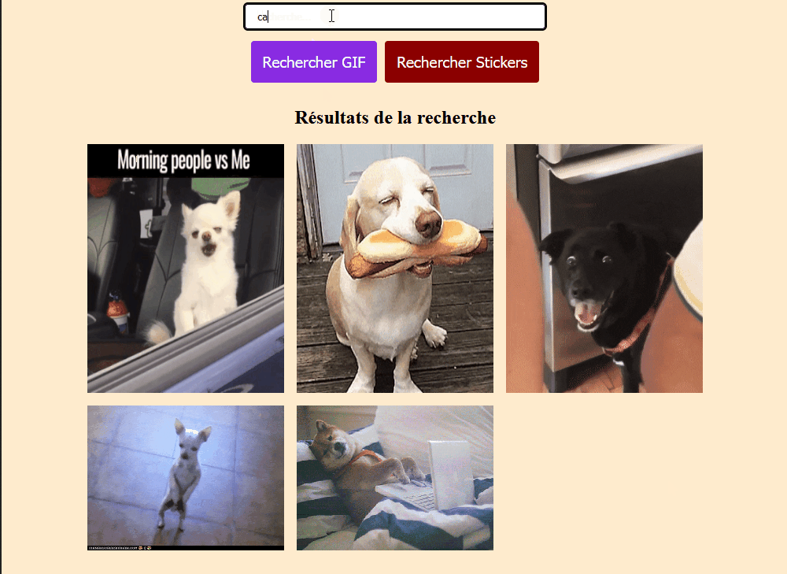  | bouton droit vers: <a href="https://github.com/ugolabo/boite_recherche_api_giphy" target="_blank">repo</a>   |
| gothon with Python 2.7 | 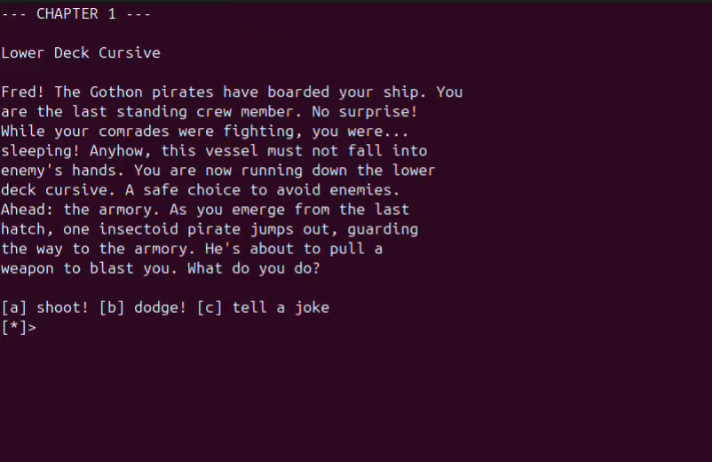  | bouton droit vers: <a href="https://github.com/ugolabo/gothon_py27" target="_blank">repo</a>  |
| web.py with Python 3.11 | 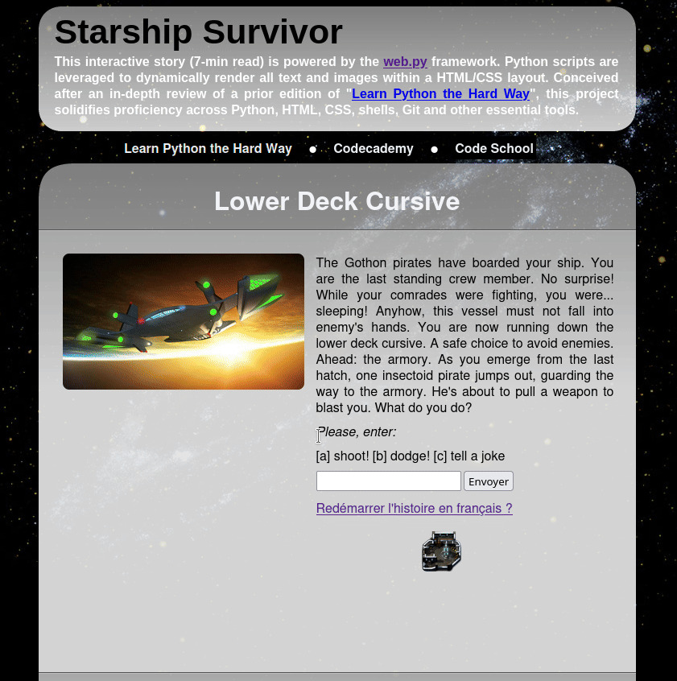  | bouton droit vers: <a href="https://github.com/ugolabo/webpy_py311" target="_blank">repo</a> (avec lien vers le site PythonAnywhere)  |
| Documentations avec sites web statiques | 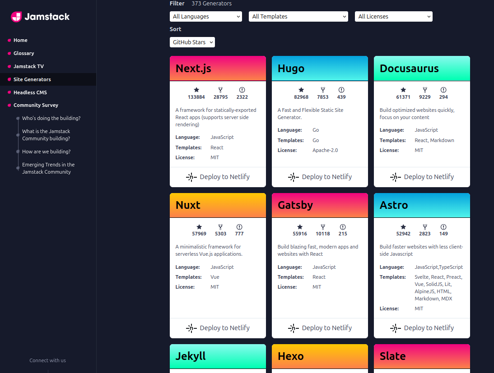  | bouton droit vers: <a href="https://github.com/ugolabo/documentations_web_statiques" target="_blank">repo</a>  |
| Apps interactives Streamlit | 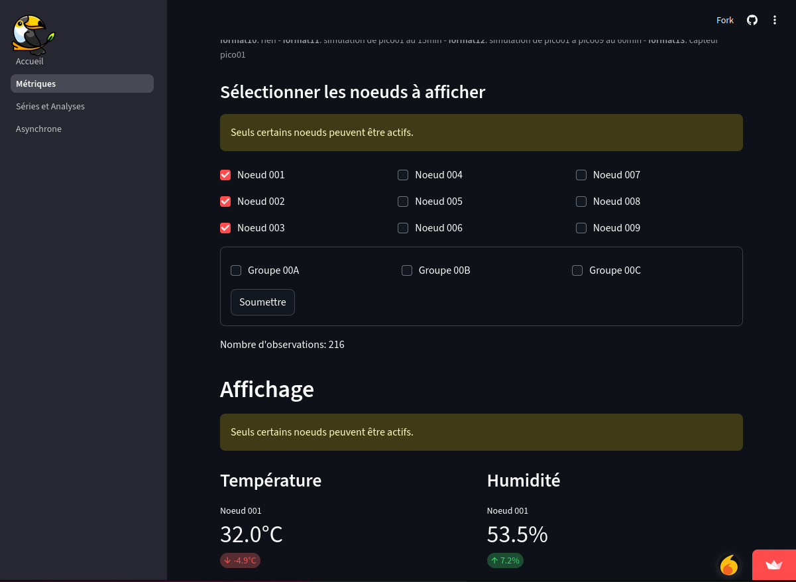  | bouton droit vers: <a href="https://github.com/ugolabo/apps_streamlit" target="_blank">repo</a> (avec lien vers le site Streamlit)  |

## IoT

| Projet | Aperçu | Lien |
|:-----|:-----|:-----|
| Système d'alarme avec un Raspberry Pi (relié au projet suivant) | 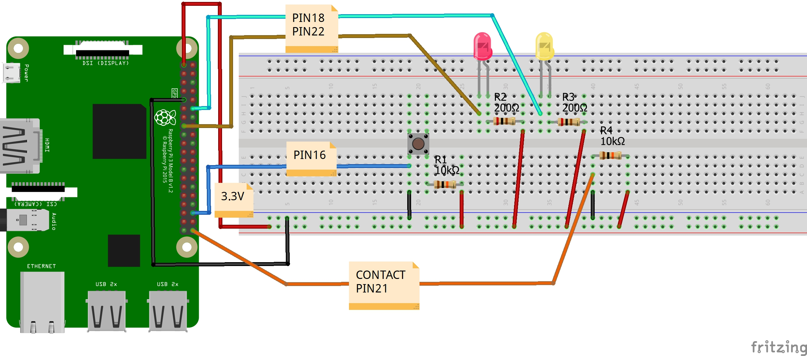  | bouton droit vers: <a href="https://github.com/ugolabo/systeme_alarme_rpi" target="_blank">repo</a>  |
| Domotique avec commandes vocales et Tkinter sur des Raspberry Pi (relié au projet précédent) | 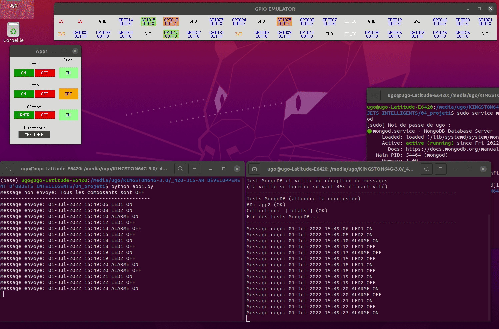  | bouton droit vers: <a href="https://github.com/ugolabo/domotique_commandes_vocales" target="_blank">repo</a>  |
| Chaine: noeuds Raspberry Pi Pico (microcontrôleur et capteur) à Streamlit (tableau de bord) via MQTT et MongoDB Atlas (relié aux projets précédents) | 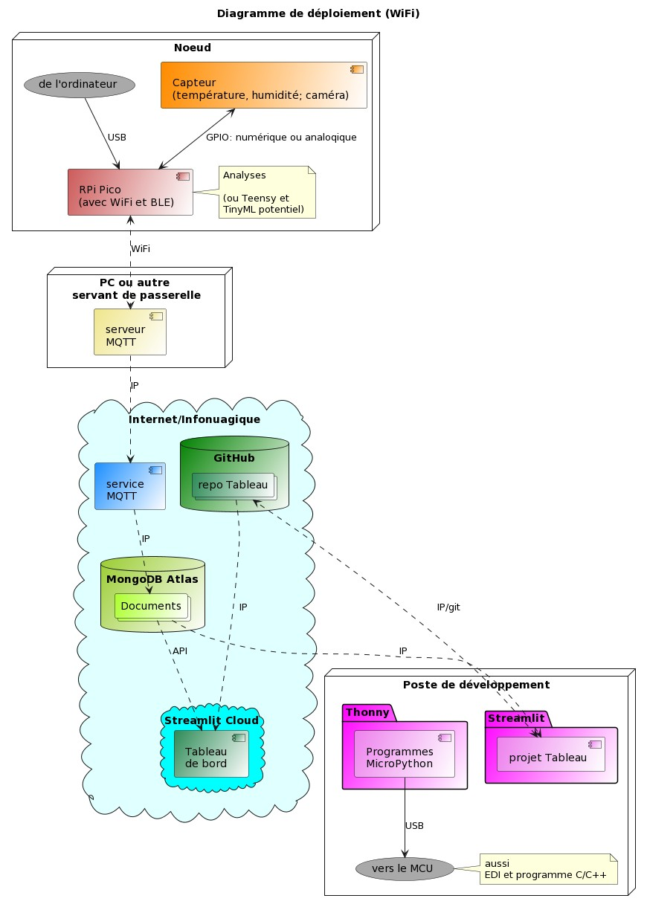  | bouton droit vers: <a href="https://github.com/ugolabo/chaine_pico_streamlit" target="_blank">repo</a>  |
| &nbsp;&nbsp;&nbsp;&nbsp;&nbsp;&nbsp;&nbsp;&nbsp;&nbsp;&nbsp;&nbsp;&nbsp;Streamlit (tableau de bord) | 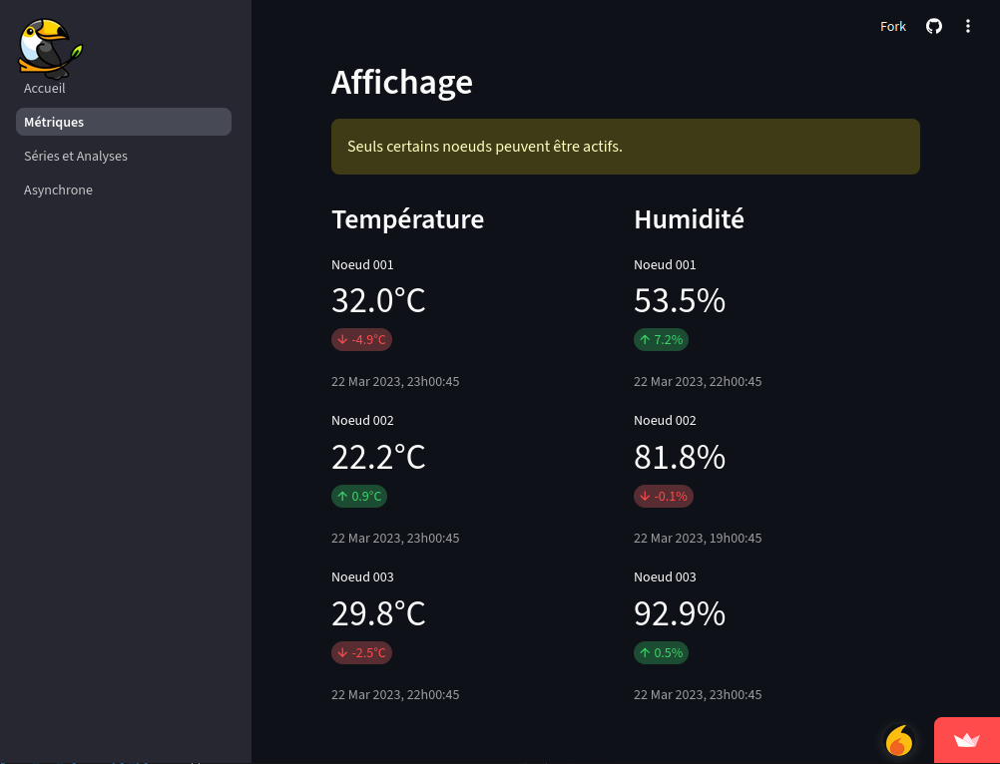  | bouton droit vers: <a href="https://toucan-fortune-streamlit-projet-integrateur-01-accueil-0fsbkp.streamlit.app/" target="_blank">site</a> (avec lien vers le site Streamlit) |

## Autres

| Projet | Aperçu | Lien |
|:-----|:-----|:-----|
| LaTeX; Pocket Book  | 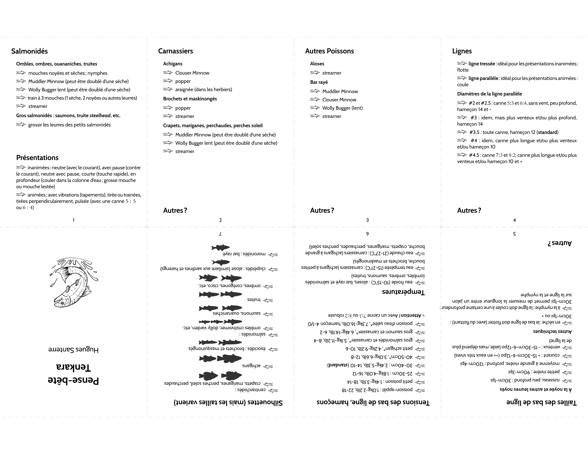  | bouton droit vers: <a href="https://github.com/ugolabo/latex_pocket_book" target="_blank">repo</a>  |
| LaTeX; dessins vectoriels  |   | bouton droit vers: <a href="https://github.com/ugolabo/latex_dessins_vectoriels" target="_blank">repo</a>  |
