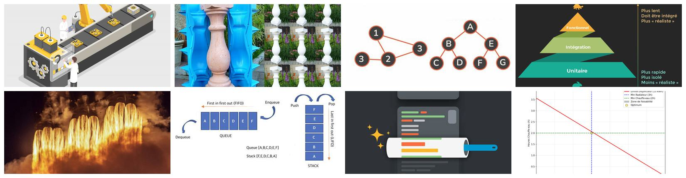
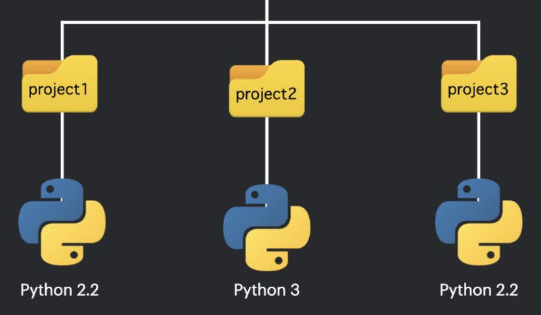
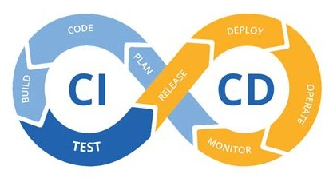
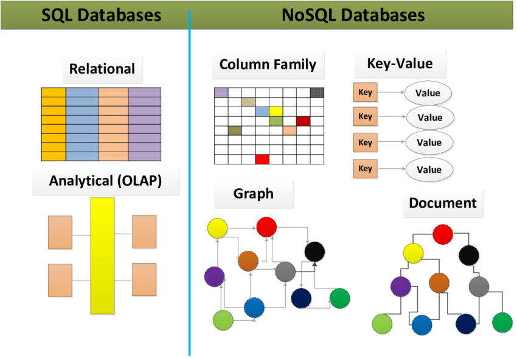
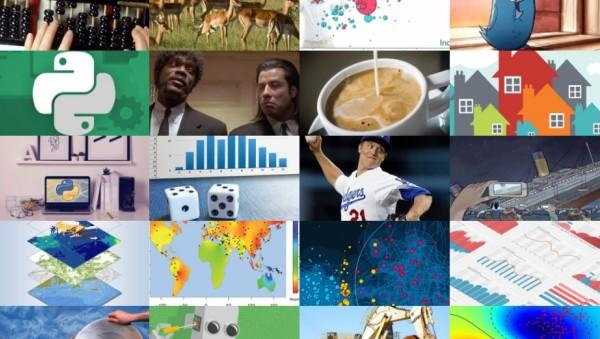
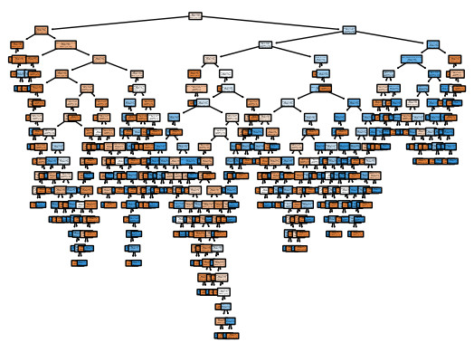
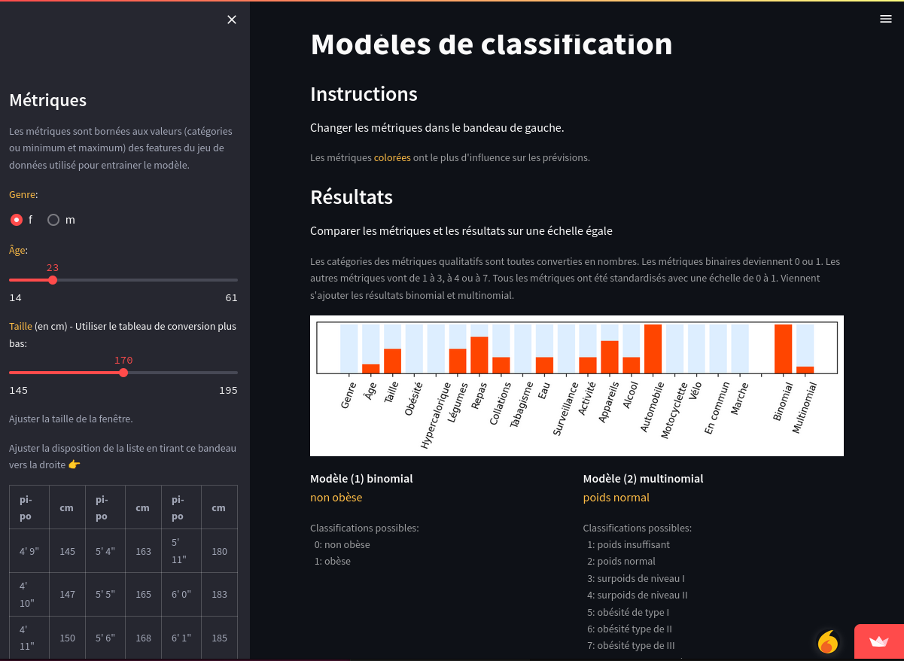

# Portfolio

Sélection de projets.

## Programmation et Bases de données

| Projet | Aperçu | Lien |
|:-----|:-----|:-----|
| Programmation Python |  | bouton droit vers: <a href="https://github.com/ugolabo/programmation_python" target="_blank">repo</a>  |  |
| Formation |   | bouton droit vers: <a href="https://ugolab.gitlab.io/formation/description/" target="_blank">site</a>  |
| Environnements virtuels, empaquetage, conteneurs Dockers |   | bouton droit vers: <a href="https://github.com/ugolabo/env_empaquetage_docker" target="_blank">repo</a>  |
| CI/CD: fichier Python, linting et tests unitaires |   | bouton droit vers: <a href="https://github.com/ugolabo/cicd_python_linting_tests" target="_blank">repo</a>  |
| Bases de données SQL et NoSQL |   | bouton droit vers: <a href="https://github.com/ugolabo/bases_donnees_sql_nosql" target="_blank">repo</a>  |

## Data Science, Machine Learning, IA

| Projet | Aperçu | Lien |
|:-----|:-----|:-----|
| Portfolio de Data Science^a  |   | bouton droit vers: <a href="https://ugofolio.netlify.app/portfolio/" target="_blank">site</a>  |
| Machine Learning avec Random Forests  |   | bouton droit vers: <a href="https://github.com/ugolabo/ml_random_forests" target="_blank">repo</a> |
| Machine Learning avec Random Forests sur Streamlit[^b]  |   | bouton droit vers: <a href="https://github.com/ugolabo/ml_random_forests_streamlit" target="_blank">repo</a>  |
| Machine Learning avec Random Forests sur Streamlit (v2)  |   | bouton droit vers: <a href="https://github.com/ugolabo/ml_random_forests_streamlit_v2" target="_blank">repo</a>  |

???

^a : Porfolio développé avant 2020 et dont quelques projets mériteraient une mise à jour.

[^b]: Machine Learning avec Random Forests sur Streamlit explique le projet, mais n'alimente plus Streamlit Cloud pour l'app interactive. Machine Learning avec Random Forests sur Streamlit (v2) alimente uniquement Streamlit Cloud.
